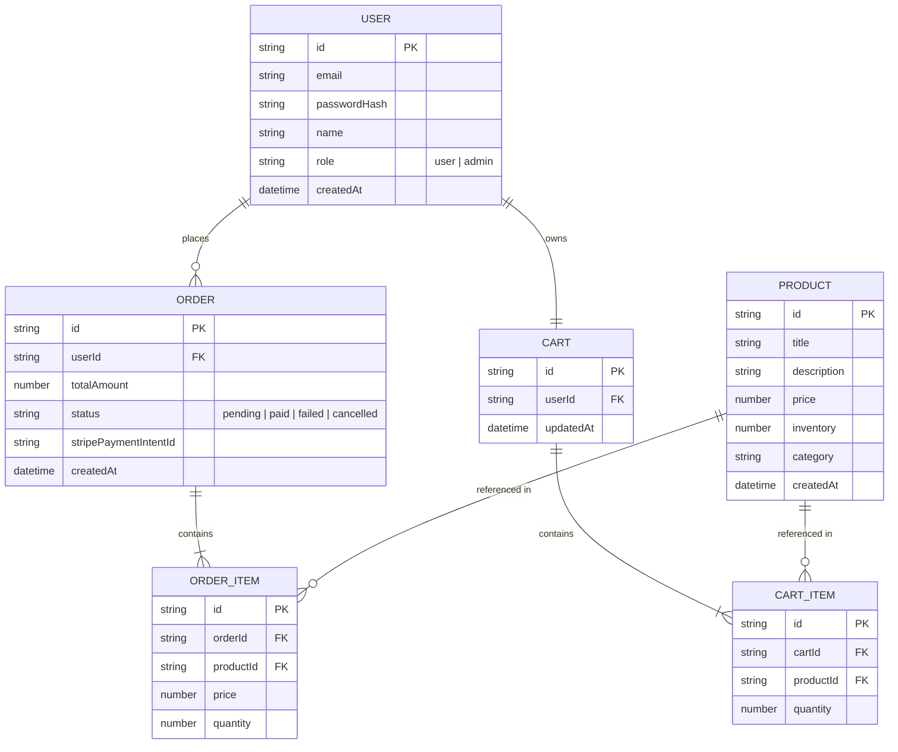

# E-Commerce REST API (Node.js / Express)

ระบบ API สำหรับแพลตฟอร์ม E-Commerce แบบครบวงจร พัฒนาด้วย Node.js, Express และเชื่อมต่อกับ Stripe Payment Gateway สำหรับการชำระเงิน

---

## 📌 1. อธิบายโจทย์และวัตถุประสงค์ (Project Overview)

โจทย์นี้คือการพัฒนา **Backend RESTful API** สำหรับระบบร้านค้าออนไลน์ (E-Commerce) ที่เน้น Business Logic และ Data Model ที่มีความซับซ้อน รวมถึงการต่อประสานกับบริการภายนอก (Third-party Integration) เช่น Stripe Payment Gateway

### จุดประสงค์หลักในการเรียนรู้และพัฒนา:
1. **User Authentication & Authorization**: การยืนยันตัวตนด้วย JWT (JSON Web Token) และการแบ่งสิทธิ์ผู้ใช้งาน (Role-Based Access Control: `user` vs `admin`)
2. **Complex CRUD & Data Modeling**: การจัดการความสัมพันธ์ของข้อมูลระหว่าง ผู้ใช้งาน (Users), สินค้า (Products), ตะกร้าสินค้า (Cart), และ คำสั่งซื้อ (Orders)
3. **External Service Integration**: การเชื่อมต่อระบบชำระเงินจริงผ่าน Stripe API (PaymentIntents / Checkout Sessions / Webhooks)
4. **Logic-heavy Application**: การจัดการสต็อกสินค้า (Inventory Control), การคำนวณราคารวม, การตรวจสอบสถานะการชำระเงิน

---

## 🎯 2. ข้อกำหนดและฟีเจอร์หลัก (Requirements)

| หมวดหมู่ | ฟีเจอร์หลัก | รายละเอียด |
|---|---|---|
| **Authentication** | สมัครสมาชิก & เข้าสู่ระบบ | User Sign up, Log in และรับ JWT Token สำหรับใช้งาน API ที่ต้องผ่านยืนยันตัวตน |
| **Admin Panel** | จัดการสินค้า & สต็อก | เฉพาะผู้ใช้ที่มีบทบาท `admin` เท่านั้นที่สามารถ เพิ่ม (Create), แก้ไข (Update), ลบ (Delete) สินค้า กำหนดราคา และอัปเดตจำนวนสต็อกได้ |
| **Product Discovery** | ค้นหา & ดูรายการสินค้า | สมาชิกและบุคคลทั่วไปสามารถดูรายการสินค้า, ค้นหาสินค้าตามชื่อ/หมวดหมู่, และดูรายละเอียดสินค้าได้ |
| **Cart Management** | จัดการตะกร้าสินค้า | เพิ่มสินค้าลงตะกร้า, แก้ไขจำนวนสินค้า, ลบสินค้าออกจากตะกร้า, ดูรายการสินค้าในตะกร้าพร้อมราคารวม |
| **Checkout & Payment** | ชำระเงินผ่าน Stripe | สั่งซื้อสินค้าจากตะกร้า, สร้าง Payment Intent/Session ไปยัง Stripe, รองรับ Stripe Webhook เพื่ออัปเดตสถานะคำสั่งซื้อเมื่อชำระเงินสำเร็จ |

---

## 🏗️ 3. โครงสร้างข้อมูล (Data Models Design)



---

## 🔌 4. รายการ API Endpoints (API Specification)

### 🔑 Authentication (`/api/auth`)
- `POST /api/auth/register` - สมัครสมาชิกใหม่ (Default Role: `user`)
- `POST /api/auth/login` - เข้าสู่ระบบ (คืนค่า JWT Token)
- `GET /api/auth/me` - ดูข้อมูลผู้ใช้งานปัจจุบัน (Requires Auth)

### 🛍️ Products (`/api/products`)
- `GET /api/products` - ดูรายการสินค้าทั้งหมด (รองรับ Query parameters: `search`, `category`, `page`, `limit`)
- `GET /api/products/:id` - ดูรายละเอียดสินค้าตาม ID

### 👑 Admin Management (`/api/admin/products`) - *Requires Admin Role*
- `POST /api/admin/products` - เพิ่มสินค้าใหม่
- `PUT /api/admin/products/:id` - แก้ไขข้อมูลสินค้า/สต็อก/ราคา
- `DELETE /api/admin/products/:id` - ลบสินค้า

### 🛒 Shopping Cart (`/api/cart`) - *Requires Auth*
- `GET /api/cart` - ดูรายการสินค้าในตะกร้าของผู้ใช้
- `POST /api/cart/items` - เพิ่มสินค้าลงในตะกร้า
- `PUT /api/cart/items/:productId` - แก้ไขจำนวนสินค้าในตะกร้า
- `DELETE /api/cart/items/:productId` - ลบสินค้าออกจากตะกร้า
- `DELETE /api/cart` - ล้างสินค้าทั้งหมดในตะกร้า

### 💳 Checkout & Orders (`/api/checkout` / `/api/orders`) - *Requires Auth*
- `POST /api/checkout/create-intent` - สร้าง Stripe PaymentIntent / Checkout Session จากตะกร้าสินค้า
- `POST /api/webhook/stripe` - Webhook Endpoint สำหรับรับ Event จาก Stripe (เช่น `payment_intent.succeeded`)
- `GET /api/orders` - ดูประวัติการสั่งซื้อของผู้ใช้
- `GET /api/orders/:id` - ดูรายละเอียดคำสั่งซื้อ

---

## 🧪 5. ขั้นตอนการทดสอบ (Testing Steps & Guide)

การทดสอบระบบจะแบ่งเป็น 3 รูปแบบหลัก ดังนี้:

### 1️⃣ การทดสอบด้วย Postman / cURL (Manual API Testing)

#### Step 1: สมัครสมาชิก & เข้าสู่ระบบ
1. ส่ง `POST /api/auth/register` ด้วยข้อมูล email และ password
2. ส่ง `POST /api/auth/login` เพื่อรับ `token`
3. คัดลอก Token ใส่ใน Authorization Header: `Bearer <YOUR_JWT_TOKEN>` สำหรับ request ถัดไป

#### Step 2: ทดสอบระบบ Admin (การเพิ่มสินค้า)
1. ใช้ผู้ใช้ที่เป็น Admin (หรือเปลี่ยน role ใน Database)
2. ส่ง `POST /api/admin/products` พร้อม payload:
   ```json
   {
     "title": "Wireless Headphone",
     "description": "Noise cancelling headphones",
     "price": 2990,
     "inventory": 50,
     "category": "Electronics"
   }
   ```
3. ตรวจสอบว่าสินค้าถูกบันทึกลงในระบบสำเร็จ

#### Step 3: ทดสอบการจัดการตะกร้าสินค้า (User Cart Flow)
1. ส่ง `GET /api/products` เพื่อดึง `productId`
2. ส่ง `POST /api/cart/items` เพื่อเพิ่มสินค้าเข้าตะกร้า:
   ```json
   {
     "productId": "<PRODUCT_ID>",
     "quantity": 2
   }
   ```
3. ส่ง `GET /api/cart` เพื่อตรวจสอบว่าราคารวมคำนวณถูกต้อง

#### Step 4: ทดสอบการชำระเงินด้วย Stripe (Checkout Flow)
1. ส่ง `POST /api/checkout/create-intent` ระบบจะคืนค่า `clientSecret` หรือ `checkoutUrl`
2. ใช้ Stripe Test Card (`4242 4242 4242 4242`) ในการทดสอบการตัดบัตรจำลอง
3. ส่ง Event จำลองผ่าน Stripe CLI หรือ Webhook simulator เพื่อทดสอบ `POST /api/webhook/stripe`
4. เรียก `GET /api/orders` เพื่อยืนยันว่าสถานะคำสั่งซื้อเปลี่ยนเป็น `paid` และสต็อกสินค้าถูกตัดลบอย่างถูกต้อง

---

### 2️⃣ การทดสอบแบบอัตโนมัติ (Automated Unit & Integration Testing)

จะมีการเขียนชุดทดสอบด้วย **Jest** และ **Supertest** ครอบคลุมเคสต่างๆ:

```bash
# คำสั่งรันการทดสอบทั้งหมด
npm test

# คำสั่งรันการทดสอบพร้อม Coverage report
npm run test:coverage
```

#### รายการ Test Scenarios ที่ครอบคลุม:
- [x] **Auth Service**:
  - การ Register ด้วย Email ซ้ำต้องแสดงข้อผิดพลาด (400 Bad Request)
  - การ Login ด้วยรหัสผ่านผิดต้องส่ง 401 Unauthorized
- [x] **Product & Admin Service**:
  - ผู้ใช้งานทั่วไป (Role `user`) พยายามสร้างสินค้าต้องโดนปฏิเสธด้วย 403 Forbidden
  - Admin สามารถ C/U/D สินค้าได้ถูกต้อง
- [x] **Cart Service**:
  - การเพิ่มสินค้าเกินจำนวนที่มีในสต็อกต้องแจ้งเตือนข้อผิดพลาด
  - คำนวณราคารวมของตะกร้าสินค้าถูกต้องตามจำนวนสินค้า
- [x] **Checkout Service**:
  - ชำระเงินสำเร็จจะล้างตะกร้าสินค้าและหักสต็อกสินค้าโดยอัตโนมัติ

---

## 🛠️ 6. เทคโนโลยีที่เลือกใช้ (Tech Stack)

- **Runtime Environment**: Node.js
- **Web Framework**: Express.js
- **Database**: MongoDB (Mongoose) หรือ SQLite / PostgreSQL (Prisma ORM)
- **Authentication**: JSON Web Token (`jsonwebtoken`), `bcryptjs`
- **Payment Gateway**: `stripe` Node SDK
- **Testing**: `jest`, `supertest`
- **Documentation**: Swagger / Postman Collection

---

## 🚀 7. วิธีการเริ่มต้นติดตั้งและใช้งาน (Getting Started)

```bash
# 1. ติดตั้ง Dependencies
npm install

# 2. ตั้งค่า Environment Variables (.env)
# PORT=5000
# DATABASE_URL=mongodb://localhost:27017/ecommerce
# JWT_SECRET=your_jwt_secret_key
# STRIPE_SECRET_KEY=sk_test_...
# STRIPE_WEBHOOK_SECRET=whsec_...

# 3. รัน Server ในโหมดพัฒนา
npm run dev
```

https://roadmap.sh/projects/ecommerce-api